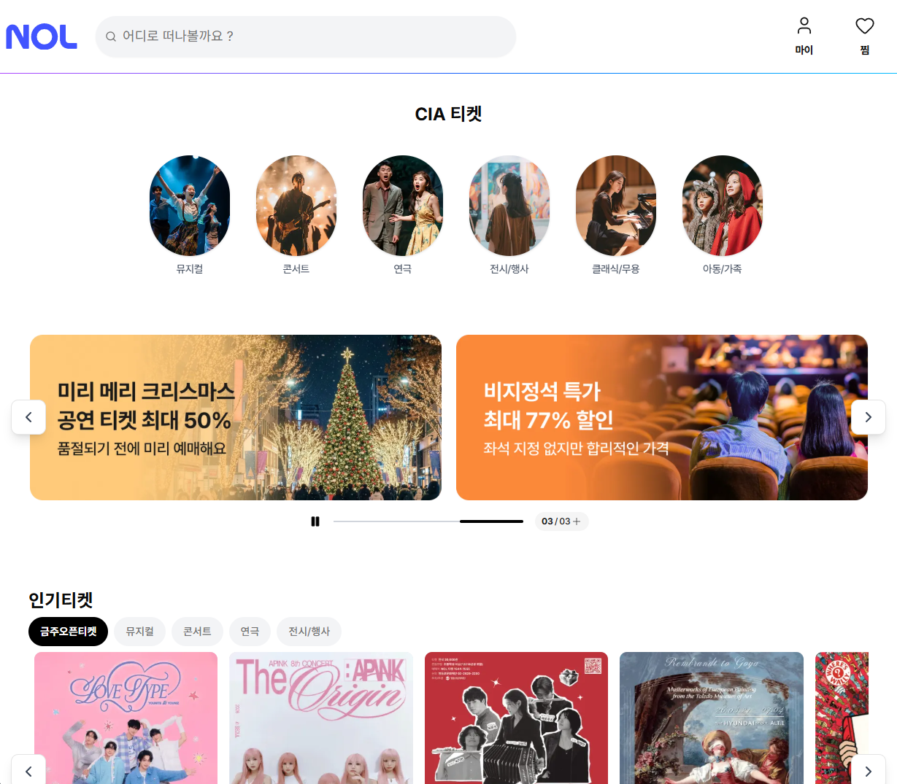
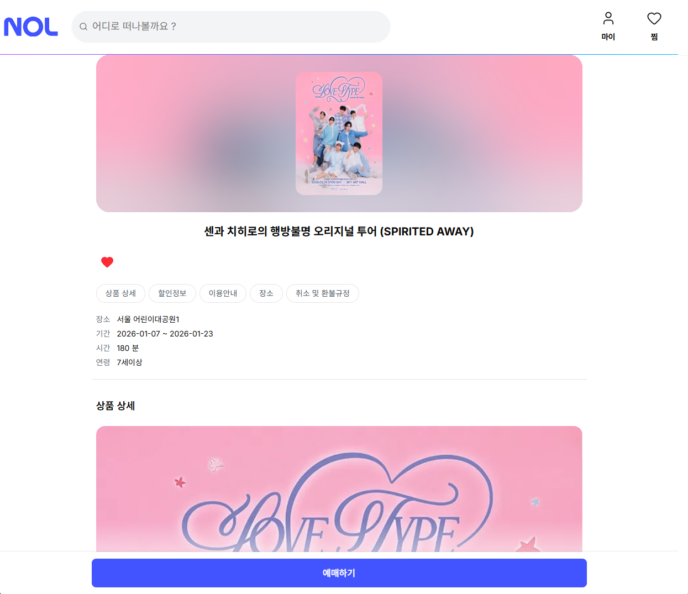
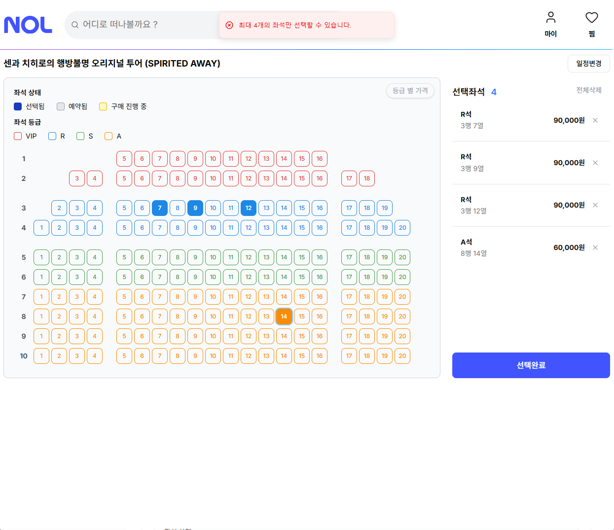
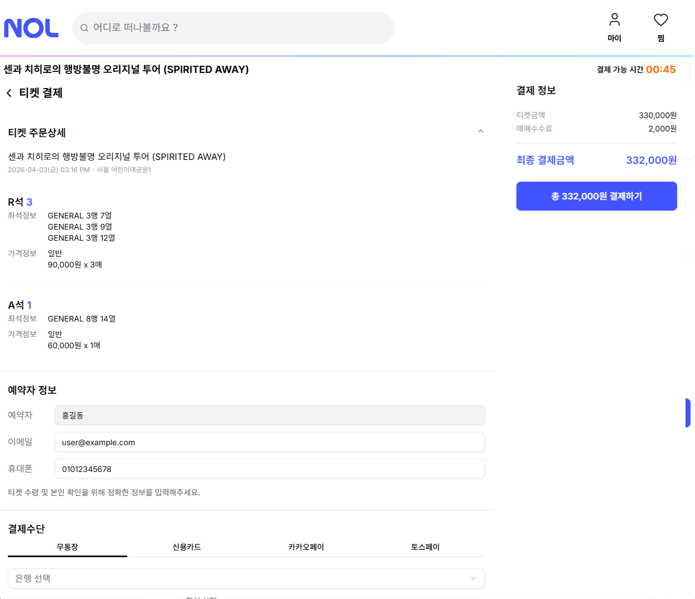
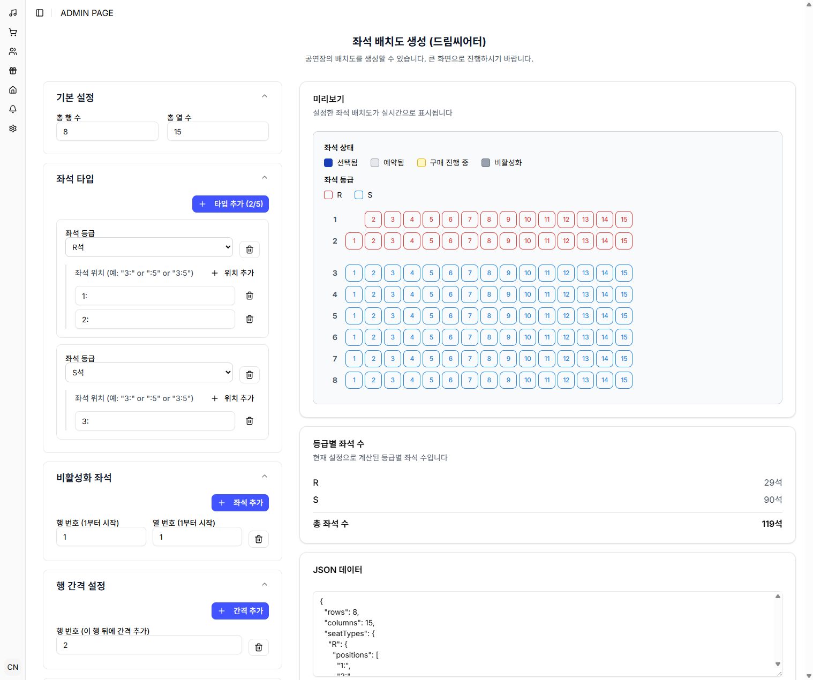

# YEME FE

Next.js 기반의 반응형 공연 티켓팅 프론트엔드 프로젝트 (모바일 / 태블릿 / PC 최적화)  
FSD (Feature-Sliced Design) 아키텍처 적용

🌐 **배포 사이트**: [https://ticket.devhong.cc](https://ticket.devhong.cc)

## 주요 기능

### 🎭 일반 사용자 (Service)
- **모바일 지원 & 반응형 UI**
  - 모바일, 태블릿, 데스크톱 전 디바이스에 최적화된 반응형 레이아웃
  - 모바일 환경에 맞춘 터치 인터랙션 및 바텀시트/드로어 UI 제공
- **홈 & 큐레이션**
  - 메인 추천 배너 캐러셀
  - 장르/태그별 추천 공연 목록 및 인기 랭킹 큐레이션
- **공연 검색 & 다중 필터**
  - 키워드 기반 실시간 공연 검색
  - 장르(뮤지컬, 콘서트, 연극, 클래식 등), 예매 상태, 지역별 다중 필터링 및 정렬
- **공연 상세 정보**
  - 시놉시스, 캐스팅, 공연 기간/시간, 관람 등급, 티켓 가격 등 상세 정보 제공
  - 공연장 위치 안내 및 회차별 잔여 좌석 현황 조회
  - Open Graph / Twitter Card 등 소셜 공유 및 검색 엔진(SEO) 최적화
- **실시간 공연 예매 (Core Point - SSE 연동)**
  - SSE(Server-Sent Events) 기반의 실시간 좌석 상태 동기화 및 동시성 예매 처리
  - 공연 회차(날짜 및 시간대) 선택 및 실시간 잔여 좌석 현황 반영
  - 구역별 인터랙티브 좌석 배치도(Seating Chart) 기반 실시간 좌석 선택
  - 좌석 등급(VIP, R, S, A석 등)별 실시간 가격 확인 및 좌석 선점 타이머/락(Lock) 관리
- **주문 & 모의 결제 (Mock / Dummy Process)**
  - 예매자 정보 입력 및 결제 수단 선택 UI (신용카드, 무통장입금, 카카오페이, 토스페이 등 모의 선택)
  - 가상 PG 결제 시뮬레이션 및 결제 유효시간 카운트다운 처리
  - 예매 완료 내역 및 가상 전자 영수증 확인
- **회원 인증 & 보안**
  - 이메일/비밀번호 기반 로그인 및 계정 인증
  - 3단계 회원가입 절차: 휴대폰 점유 인증 → 이메일 인증번호 검증 → 비밀번호 설정
  - 아이디 및 비밀번호 찾기
- **마이페이지 & 관심 공연**
  - 예매 내역 조회 및 상태별(예매완료, 관람완료, 취소 등) 상세 내역 확인
  - 티켓 예매 취소 및 환불 처리
  - 찜한 공연(관심 공연) 보관함 및 빠른 예매 연결

### 🛠️ 관리자 (Admin)
- **공연장(Venues) & 좌석 배치도 관리**
  - 공연장 기본 정보 등록, 수정 및 상세 조회
  - 공연장별 맞춤 구역/좌석 배치도(Seating Chart) 레이아웃 생성 및 편집
- **공연(Performances) & 회차 스케줄 관리**
  - 신규 공연 등록, 정보 수정 및 삭제 (포스터, 상세 이미지, 관람 등급 등)
  - 공연 회차(날짜/시간)별 스케줄 편성 및 회차별 좌석 등급·가격 매핑
- **판매사/기획사(Companies) 관리**
  - 공연 제작/판매 기획사 정보 등록, 수정 및 목록 관리
- **쿠폰 & 프로모션(Coupons) 관리**
  - 할인 쿠폰 생성 (정률/정액 할인, 유효기간, 사용 조건 설정)
  - 쿠폰 발급 목록 및 상세 현황 조회/수정
- **홈 화면 큐레이션 관리 (Home Tag Order)**
  - 메인 페이지 섹션별 태그 및 노출 공연 순서 드래그 앤 드롭 관리
- **공지사항(Notices) 관리**
  - 서비스 공지사항 작성, 수정 및 목록 관리

## 스크린샷

### 메인 페이지 (공연 리스트)


### 공연 상세


### 좌석 선택


### 결제


### 관리자 배치도 설정


## 기술 스택

### 핵심 프레임워크
- **Next.js 16.2.1** - App Router, SSR/SSG
- **React 19.2.0** - React Compiler 활성화
- **TypeScript 5** - Strict mode

### 패키지 매니저
- **pnpm** - 빠르고 효율적인 디스크 공간 사용

### 스타일링
- **Tailwind CSS v4** - Utility-first CSS 프레임워크
- **Shadcn UI** - Radix UI 기반 재사용 가능한 컴포넌트 라이브러리

### 상태 관리 & 폼
- **TanStack React Query v5** - 서버 상태 관리, 캐싱, 데이터 동기화
- **Zustand v5** - 가벼운 클라이언트 전역 상태 관리
- **React Hook Form** - 고성능 폼 상태 관리
- **Zod** - 스키마 기반 런타임 데이터 유효성 검사

### API & 실시간 통신
- **SSE (Server-Sent Events)** - 실시간 좌석 상태 동기화 및 예매 이벤트 스트리밍
- **REST API** - 백엔드 API 서버와 통신
- **fetch API** - Next.js 내장 fetch (캐싱, revalidation)
- **Orval** - OpenAPI 스펙 기반 TypeScript 타입 및 API 클라이언트 자동 생성
- **MSW (Mock Service Worker)** - API 모킹을 통한 독립적인 개발 환경 지원

### 테스트 & 코드 품질
- **Vitest & Testing Library** - 단위 및 통합 테스트
- **Playwright** - E2E(End-to-End) 브라우저 테스트
- **Lighthouse** - 웹 성능 및 접근성 배치 벤치마크
- **Biome 2.2.0** - 고속 Linter & Formatter

### 모니터링
- **Sentry (@sentry/nextjs)** - 실시간 에러 추적 및 성능 모니터링

## 프로젝트 구조 (FSD 기반)

```
yeme-fe/
├── src/
│   ├── app/                    # Next.js App Router (라우팅 및 진입점)
│   │   ├── (routes)/          # 라우트 그룹
│   │   ├── layout.tsx         # Root layout
│   │   └── page.tsx           # Home page
│   │
│   ├── views/                  # 페이지 컴포넌트 (FSD pages 레이어)
│   │   ├── home/
│   │   ├── product/
│   │   └── ...
│   │
│   ├── widgets/                # 독립적인 대형 UI 블록
│   │   ├── header/
│   │   ├── footer/
│   │   └── ...
│   │
│   ├── features/               # 비즈니스 기능 단위 (사용자 인터랙션)
│   │   ├── auth/
│   │   ├── cart/
│   │   └── ...
│   │
│   ├── entities/               # 비즈니스 엔티티 (도메인 모델 및 UI)
│   │   ├── product/
│   │   ├── user/
│   │   └── ...
│   │
│   └── shared/                 # 공통 코드 및 인프라
│       ├── api/               # API 클라이언트 및 Orval 생성 코드
│       ├── ui/                # 공통 UI 컴포넌트 (Shadcn UI 포함)
│       ├── lib/               # 유틸리티 함수
│       ├── hooks/             # 공통 커스텀 훅
│       ├── types/             # 공통 타입 정의
│       ├── constants/         # 공통 상수 (PAGES 라우트 상수 등)
│       └── config/            # 설정 파일
│
├── public/                     # Static assets & MSW worker
├── tests/                      # 테스트 코드 (E2E 등)
├── scripts/                    # 유틸리티 및 벤치마크 스크립트
├── .vscode/                    # VSCode 설정
├── biome.json                  # Biome 설정
├── next.config.ts              # Next.js 설정
└── tsconfig.json               # TypeScript 설정
```

## 시작하기

### 필수 요구사항
- Node.js 20 이상
- pnpm 9 이상

### 설치

```bash
# 의존성 설치
pnpm install
```

### 환경변수 설정

`.env.example` 파일을 복사하여 `.env.local` 파일을 생성하고 값을 설정합니다:

```bash
# .env.example 파일 복사
cp .env.example .env.local

# 또는 Windows PowerShell에서
Copy-Item .env.example .env.local
```

주요 환경변수:

```bash
# 사이트 기본 URL (배포 환경에 맞게 변경)
NEXT_PUBLIC_SITE_URL=https://yourdomain.com

# API 서버 URL
NEXT_PUBLIC_API_SERVER=https://your-api-server.com

# 개발 환경 API 서버 URL
NEXT_PUBLIC_API_DEV_SERVER=http://localhost:8080

# Vercel 배포 검증 토큰 (Cloudflare 보안 우회용)
VERCEL_DEPLOYMENT_VERIFY_TOKEN=your_vercel_verify_token_here

# Sentry 인증 토큰 (Sentry 에러 모니터링용)
SENTRY_AUTH_TOKEN=your_sentry_auth_token_here
```

**Vercel 배포 시 주의사항:**
- Vercel 프로젝트 설정에서 `NEXT_PUBLIC_SITE_URL`을 배포 도메인으로 설정해야 합니다.
- 예: `https://yourdomain.com` 또는 `https://your-project.vercel.app`

### 개발 서버 실행

```bash
pnpm dev
```

브라우저에서 [http://localhost:3000](http://localhost:3000)을 엽니다.

## 명령어

```bash
# 개발 서버 실행
pnpm dev

# 프로덕션 빌드
pnpm build

# 프로덕션 서버 실행
pnpm start

# 코드 린트 검사
pnpm lint

# 코드 자동 포맷팅
pnpm format

# 단위 / 통합 테스트 실행 (Vitest)
pnpm test

# Lighthouse 성능 측정 배치 실행
pnpm test:perf

# API 타입 및 클라이언트 자동 생성 (Orval)
pnpm orval

# Shadcn UI 컴포넌트 추가
pnpm dlx shadcn@latest add button

# Playwright MCP 서버 실행
pnpm mcp:playwright
```

### API 자동 생성 (Orval)

OpenAPI 스펙을 기반으로 TypeScript 타입 및 API 클라이언트를 자동 생성합니다.  
상세한 아키텍처 및 사용법은 [`document/tech/orval.md`](./document/tech/orval.md)를 참조하세요.

- **생성 명령어**: `pnpm orval`
- **설정 파일**: `orval.config.ts`
- **생성 위치**:
  - API 클라이언트: `src/shared/api/orval/`
  - TypeScript 타입: `src/shared/api/orval/types/`
- **주요 특징**: OpenAPI 태그별 파일 분리(`tags-split`), Custom fetch wrapper (`fetch-wrapper.ts`) 연동, Zod 스키마 자동 생성 (`@orval/zod`)

## Docker 실행

Next.js standalone 빌드 결과물을 사용하여 경량 Docker 컨테이너를 실행할 수 있습니다.

```bash
# Docker 이미지 빌드
docker build -t yeme-fe .

# Docker 컨테이너 실행
docker run -p 3000:3000 yeme-fe
```

## 개발 가이드

상세한 개발 규칙 및 컨벤션은 [`claude.md`](./claude.md)를 참조하세요.

## 문제 해결

### 빌드 에러
```bash
# Linux/macOS
rm -rf .next
pnpm build

# Windows PowerShell
Remove-Item -Recurse -Force .next
pnpm build
```

### 캐시 및 의존성 문제
```bash
# Linux/macOS
rm -rf .next node_modules
pnpm install

# Windows PowerShell
Remove-Item -Recurse -Force .next, node_modules
pnpm install
```

### 타입 에러
- TypeScript 버전 확인
- `pnpm orval` 실행하여 최신 API 타입 생성
- `pnpm install` 재실행

## 참고 자료

- [Next.js 공식 문서](https://nextjs.org/docs)
- [Feature-Sliced Design 공식 문서](https://feature-sliced.design/)
- [TanStack Query 공식 문서](https://tanstack.com/query/latest)
- [Zustand 공식 문서](https://zustand.docs.pmnd.rs/)
- [Biome 공식 문서](https://biomejs.dev/)
- [pnpm 공식 문서](https://pnpm.io/)
- [Tailwind CSS 공식 문서](https://tailwindcss.com/docs)
- [Shadcn UI 공식 문서](https://ui.shadcn.com/)

## 라이선스

MIT