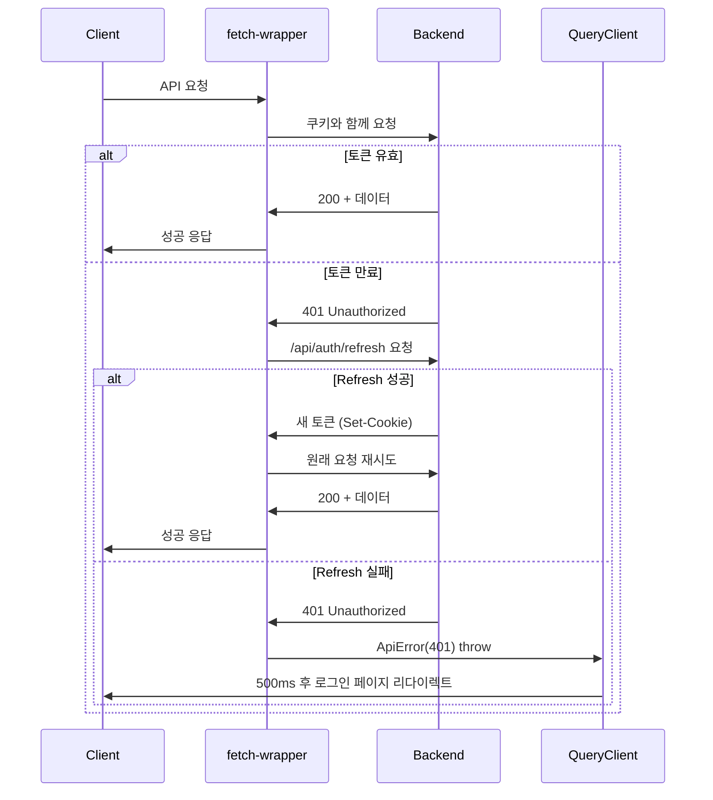
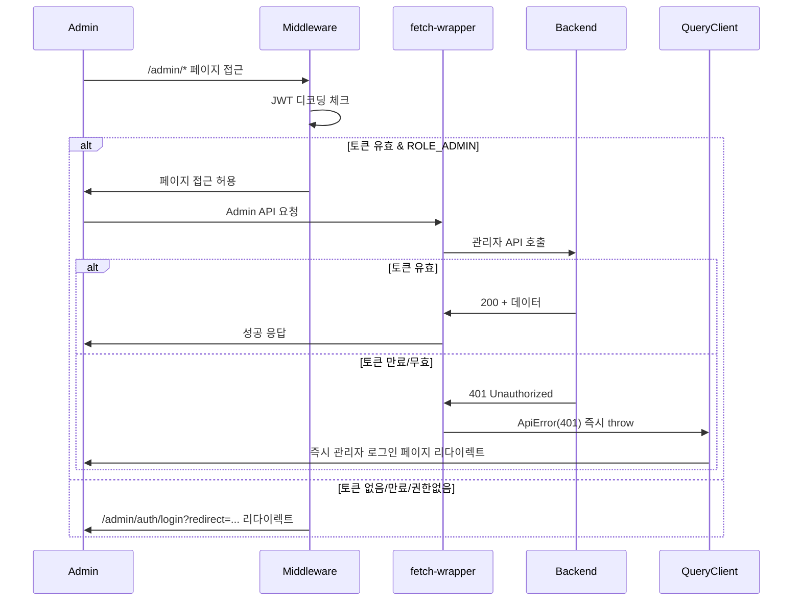

# API 아키텍처 및 플로우

## 🎯 전체 아키텍처 개요

본 프로젝트는 **Feature-Sliced Design(FSD)**와 **Clean Architecture** 원칙을 따르는 API 레이어를 구축했습니다.

## 📐 레이어 구조

```
src/
├── app/                          # Next.js App Router + 전역 설정
│   ├── error.tsx                # 전역 에러 페이지 (400/500 에러 UI)
│   └── providers/
│       └── getQueryClient.ts     # TanStack Query 전역 에러 처리
├── shared/                       # 공통 레이어 (모든 레이어에서 사용)
│   ├── api/
│   │   ├── orval/               # Orval 생성 코드 (자동)
│   │   ├── fetch-wrapper.ts     # 클라이언트 HTTP 클라이언트
│   │   └── server-fetch-wrapper.ts  # 서버 HTTP 클라이언트
│   └── lib/
│       └── errors.ts            # 공통 에러 클래스 (ApiError, ClientError, ServerError)
├── entities/                     # 비즈니스 엔티티 레이어
│   ├── auth/
│   │   ├── api/                 # API 래퍼 (Clean Architecture)
│   │   ├── model/               # 도메인 모델 (Zod 스키마, 타입)
│   │   └── index.ts             # Public API
│   └── performance/
│       ├── api/                 # 공연 관련 API 래퍼
│       ├── model/               # 공연 도메인 모델
│       └── index.ts             # Public API
└── features/                     # 기능 레이어 (사용자 시나리오)
    ├── admin/                   # 관리자 기능 그룹
    │   ├── admin-auth/          # 관리자 인증
    │   │   ├── api/
    │   │   ├── model/
    │   │   ├── ui/
    │   │   └── index.ts
    │   ├── performance/         # 관리자 공연 관리
    │   │   ├── lib/             # usePerformanceQueries 등
    │   │   ├── model/           # performance-form.schema.ts
    │   │   ├── ui/              # PerformanceForm, CreateForm 등
    │   │   └── index.ts
    │   ├── company-management/  # 공연 업체 관리
    │   ├── venue-form/          # 공연장 폼
    │   ├── venue-delete/        # 공연장 삭제
    │   ├── seating-chart/       # 좌석 배치도 관리
    │   └── performance-schedule-management/  # 공연 일정 관리
    └── service/                 # 서비스 기능 그룹
        ├── auth/                # 서비스 사용자 인증
        │   ├── lib/             # useEmailLogin, useEmailSignup 등
        │   ├── ui/              # LoginForm, SignupForm 등
        │   └── index.ts
        ├── home/                # 홈페이지 기능
        │   ├── model/           # 카테고리, 배너 데이터
        │   ├── ui/              # 배너, 공연 리스트 등
        │   └── index.ts
        └── performance-detail/  # 공연 상세 페이지
            ├── lib/             # useScrollSpy 등
            ├── model/           # 타입, 상수 정의
            ├── ui/              # 상세 정보 컴포넌트들
            └── index.ts
```

## 🔄 API 호출 전체 플로우

### 클라이언트 사이드 (CSR)
```
React Component (EmailLoginForm.tsx)
  ↓ (react-hook-form + Zod 검증)
TanStack Query Hook (useEmailLogin.ts)
  ↓ (비즈니스 로직)
API Wrapper (entities/auth/api/auth.api.ts)
  ↓ (Clean Architecture - union 타입 정제)
Orval Generated Functions (shared/api/orval/auth/auth.ts)
  ↓ (OpenAPI 스펙 기반 생성)
orvalFetch (shared/api/fetch-wrapper.ts)
  ↓ (토큰 관리, 갱신, 에러 처리)
Native Fetch API
  ↓
Backend Server (OpenAPI)
```

### 서버 사이드 (SSR)
```
Server Component (PerformanceListServer.tsx)
  ↓
Feature API (home-server.api.ts)
  ↓ (비즈니스 로직)
serverFetch (shared/api/server-fetch-wrapper.ts)
  ↓ (인증 체크, 에러 처리)
Native Fetch API
  ↓
Backend Server (OpenAPI)
  ↓
❌ 에러 발생 시
  ├─ 401: redirect(로그인 페이지)
  ├─ 400번대: ClientError throw → app/error.tsx (errorCode + message)
  └─ 500번대: ServerError throw → app/error.tsx (HTTP 코드)
```

## 🖥️ 서버 사이드 데이터 페칭

### 서버 vs 클라이언트 구분

| 구분 | 서버 컴포넌트 (SSR) | 클라이언트 컴포넌트 (CSR) |
|------|-------------------|------------------------|
| **Wrapper** | `server-fetch-wrapper.ts` | `fetch-wrapper.ts` |
| **인증 방식** | `cookies()` API 사용 | `credentials: 'include'` |
| **401 처리** | `redirect(로그인)` | 토큰 갱신 → 실패시 에러 throw |
| **에러 처리** | `app/error.tsx` (Next.js) | React Query or try-catch |
| **사용 위치** | Server Component | Client Component |

### 서버 Fetch Wrapper 특징

```typescript
// shared/api/server-fetch-wrapper.ts

/**
 * 서버 컴포넌트용 API 클라이언트
 * - 인증이 필요한 경우 쿠키 확인 후 없으면 redirect
 * - 에러 발생 시 적절한 에러 객체 throw
 */
export async function serverFetch<T>(
  url: string,
  options: ServerFetchOptions = {},
): Promise<T>
```

**주요 옵션:**
- `requireAuth`: 일반 사용자 인증 필요 여부
- `requireAdmin`: 관리자 인증 필요 여부
- `cache`: Next.js fetch 캐시 옵션 (`no-store`, `force-cache` 등)

### 에러 처리 플로우

#### 1️⃣ 인증 에러 (401)
```
API 요청 → 401 응답
  ↓
serverFetch: UnauthorizedError throw
  ↓
Next.js가 자동으로 캐치
  ↓
redirect(로그인 페이지)
```

#### 2️⃣ 클라이언트 에러 (400번대, 401 제외)
```
API 요청 → 400/403/404 등
  ↓
serverFetch: ClientError throw (errorCode + message 포함)
  ↓
app/error.tsx
  ↓
UI에 errorCode와 message 표시
  [에러 코드: VALIDATION_ERROR]
  [필수 항목을 입력해주세요]
```

#### 3️⃣ 서버 에러 (500번대)
```
API 요청 → 500/502/503 등
  ↓
serverFetch: ServerError throw
  ↓
app/error.tsx
  ↓
통일된 UI + HTTP 코드 표시
  [HTTP 500]
  [일시적인 문제가 발생했습니다]
```

### 사용 예시

```typescript
// features/home/api/home-server.api.ts

/**
 * 서버에서 공연 목록을 직접 fetch
 */
export async function getPerformancesForServer(): Promise<PerformanceResponse[]> {
  const response = await serverFetch<{ data: PerformanceResponse[] }>(
    "/api/performances",
    {
      cache: "no-store",      // 실시간 데이터
      requireAuth: false,     // 공개 API
    },
  );
  return response.data || [];
}
```

```typescript
// features/home/ui/PerformanceListServer.tsx

/**
 * 서버 컴포넌트 - 데이터 fetch 및 렌더링
 */
export default async function PerformanceListServer() {
  // 서버에서 직접 데이터 fetch
  const performances = await getPerformancesForServer();

  // 클라이언트 컴포넌트에 데이터 전달
  return <PerformanceListClient initialData={performances} />;
}
```

### 공통 에러 클래스

```typescript
// shared/lib/errors.ts

/**
 * HTTP 상태 코드에 따라 적절한 에러 객체 생성
 */
export function createApiError(
  statusCode: number,
  errorResponse?: ErrorResponse,  // { errorCode: string, message: string }
): ApiError {
  if (statusCode === 401) {
    return new UnauthorizedError(errorResponse?.message, errorResponse);
  }

  if (statusCode >= 400 && statusCode < 500) {
    return new ClientError(statusCode, errorResponse);
  }

  if (statusCode >= 500) {
    return new ServerError(statusCode, errorResponse);
  }

  return new ApiError(errorResponse?.message, statusCode, errorResponse);
}
```

### 전역 에러 페이지

```typescript
// app/error.tsx

/**
 * 서버/클라이언트 컴포넌트에서 발생한 에러를 캐치
 */
export default function ErrorPage({ error, reset }: ErrorPageProps) {
  // ClientError: errorCode + message 표시
  if (isClientError(error)) {
    return <ClientErrorUI error={error} />;
  }

  // ServerError: HTTP 코드 + 통일된 메시지
  if (isServerError(error)) {
    return <ServerErrorUI error={error} />;
  }

  // 일반 에러
  return <GenericErrorUI error={error} />;
}
```

## 🛡️ 차별화된 인증 에러 처리

### 이벤트 기반 인증 에러 처리 시스템 (2025년 업데이트)

#### 1️⃣ 이벤트 기반 시스템 구조
```
shared/
├── events/
│   └── auth-events.ts           # 인증 관련 이벤트 정의
├── components/
│   └── AuthEventHandler.tsx    # 전역 이벤트 리스너
└── api/
    └── fetch-wrapper.ts         # 이벤트 발생 로직
```

#### 2️⃣ 일반 사용자 (Refresh Token 사용)
```
API 요청 → 401 응답
  ↓
fetch-wrapper: URL 체크 (!fullUrl.includes("/admin/"))
  ↓
Refresh Token 자동 갱신 시도
  ├── 성공: 새 토큰으로 원래 요청 재시도
  └── 실패: dispatchUnauthorizedEvent(currentUrl, "인증이 필요합니다")
      ↓
AuthEventHandler: 이벤트 수신
  ↓
router.push(`/auth/login?redirect=${encodeURIComponent(currentUrl)}`)
```

#### 3️⃣ 관리자 (Refresh Token 미사용 - 보안 강화)
```
Admin API 요청 → 401 응답
  ↓
fetch-wrapper: URL 체크 (fullUrl.includes("/admin/"))
  ↓
dispatchAdminUnauthorizedEvent("관리자 인증이 필요합니다")
  ↓
AuthEventHandler: 관리자 이벤트 수신
  ↓
router.push("/admin/auth/login")
```

#### 4️⃣ 리다이렉트 URL 처리 플로우
```
인증 실패 페이지 (예: /products/123)
  ↓
이벤트 발생: { redirectUrl: "/products/123" }
  ↓
로그인 페이지로 이동: /auth/login?redirect=%2Fproducts%2F123
  ↓
로그인 성공 시: useEmailLogin(redirectUrl)
  ↓
원래 페이지 복귀: /products/123
```

#### 5️⃣ Middleware 차단 (페이지 접근 시)
```
/admin/* 페이지 접근 시도
  ↓
adminAuth Middleware: JWT 디코딩
  ├── 토큰 없음/만료/권한없음
  └── /admin/auth/login?redirect={pathname}
      ↓
로그인 성공 후 원래 페이지 복원
```

#### 6️⃣ 핵심 컴포넌트 구현

**AuthEventHandler.tsx (전역 이벤트 리스너)**
```typescript
export function AuthEventHandler() {
  const router = useRouter();

  useEffect(() => {
    const handleUnauthorized = (event: CustomEvent<UnauthorizedEventData>) => {
      const { redirectUrl, message } = event.detail;
      if (message) toast.error(message);
      
      const loginUrl = `${PAGES.AUTH.LOGIN.path}?redirect=${encodeURIComponent(redirectUrl)}`;
      router.push(loginUrl);
    };

    window.addEventListener(AUTH_EVENTS.UNAUTHORIZED, handleUnauthorized);
    return () => window.removeEventListener(AUTH_EVENTS.UNAUTHORIZED, handleUnauthorized);
  }, [router]);

  return null;
}
```

**useEmailLogin.ts (리다이렉트 처리)**
```typescript
const useEmailLogin = (redirectUrl?: string) => {
  const loginMutation = useMutation({
    onSuccess: (data) => {
      setUser(data);
      const targetUrl = redirectUrl || PAGES.HOME.path;
      router.push(targetUrl); // 로그인 후 원래 페이지로 복귀
    },
  });
};
```

#### 7️⃣ 장점
- ✅ NextJS 라우터를 통한 부드러운 페이지 전환
- ✅ 클라이언트 사이드 네비게이션 활용
- ✅ 정확한 브라우저 히스토리 관리
- ✅ SSR/SSG와의 호환성 향상
- ✅ 컴포넌트 간 느슨한 결합 (이벤트 기반)
- ✅ 테스트 용이성 증대

### 동시 요청 Race Condition 방지
```
여러 API가 동시에 401 응답을 받은 경우:
1. 첫 번째 요청이 토큰 갱신 시작 (isRefreshing = true)
2. 나머지 요청들은 같은 Promise 대기 (refreshPromise 공유)
3. 갱신 완료 후 모든 요청이 새 토큰으로 자동 재시도
4. 사용자는 인터럽트 없이 계속 사용 가능
```

## 🏗️ Clean Architecture 구현

### API Wrapper 패턴
```typescript
// entities/auth/api/auth.api.ts
export const loginApi = async (
  loginRequest: LoginRequest,
): Promise<TokenResponse> => {
  const response = await login(loginRequest);

  // union 타입(성공|실패)을 정제하여 성공 데이터만 반환
  if (response.status !== 200) {
    const errorMessage = "data" in response && response.data && "message" in response.data
      ? response.data.message
      : "로그인에 실패했습니다.";
    throw new Error(errorMessage);
  }

  return response.data;  // 성공 시에만 데이터 반환
};
```

**장점:**
- TanStack Query의 `onSuccess`에서 타입 체크 불필요
- 에러와 성공 케이스가 명확히 분리됨
- 비즈니스 로직과 인프라 관심사 분리

## 🎨 FSD 의존성 규칙

```
app → views → widgets → features → entities → shared
     (하위 레이어만 import 가능)
```

### Import 예시
```typescript
// ✅ 올바른 의존성
// features에서 entities와 shared import
import { loginRequestSchema } from "@/entities/auth";
import type { LoginRequest } from "@/shared/api/orval/types";

// ❌ 잘못된 의존성
// entities에서 features import (불가능)
```

## 🔧 차별화된 토큰 관리 시스템

### 일반 사용자 토큰 생명주기
```
1. 로그인 성공
   ↓
2. httpOnly 쿠키로 Access + Refresh Token 저장 (도메인: .ticket.devhong.cc)
   ↓
3. API 요청 시 쿠키 자동 전송 (credentials: 'include')
   ↓
4. 401 에러 발생 시 Refresh Token으로 자동 갱신
   ├── 성공: 새 토큰으로 재시도
   └── 실패: 로그아웃 처리
```

### 관리자 토큰 생명주기 (보안 강화)
```
1. 관리자 로그인 성공
   ↓
2. httpOnly 쿠키로 Access Token만 저장 (Refresh Token 미사용)
   ↓
3. API 요청 시 쿠키 자동 전송
   ↓
4. 401 에러 발생 시 Refresh 시도 없이 즉시 로그아웃
   ↓
5. 토큰 만료 시간에 따른 강제 재인증 (보안 극대화)
```

### 저장소 전략
- **httpOnly 쿠키**: Access Token (XSS 방지)
- **httpOnly 쿠키**: Refresh Token (일반 사용자만)
- **메모리**: 갱신 중 상태 관리 (`isRefreshing`, `refreshPromise`)
- **도메인**: `.ticket.devhong.cc` (서브도메인 간 쿠키 공유)

### 보안 비교표
| 구분 | 일반 사용자 | 관리자 |
|------|------------|--------|
| **Refresh Token** | ✅ 사용 | ❌ 미사용 |
| **401 시 동작** | 자동 갱신 시도 | 즉시 로그아웃 |
| **세션 지속** | 장기간 (편의성) | 토큰 만료까지 (보안) |
| **공격 표면** | 중간 | 최소화 |
| **사용자 경험** | 끊김 없음 | 주기적 재인증 |

## 📊 TanStack Query 통합

### v5 호환성
```typescript
// TanStack Query v5에서 전역 onError 제거됨
// QueryCache/MutationCache 구독으로 대체
queryClient.getQueryCache().subscribe((event) => {
  if (event.type === "updated" && event.query.state.status === "error") {
    handleAuthError(event.query.state.error);
  }
});
```

### 재시도 전략 (차별화된 처리)
```typescript
retry: (failureCount, error) => {
  // 401 에러는 재시도 하지 않음
  // 관리자: 리프레시 토큰 미사용으로 즉시 로그아웃
  // 일반 사용자: 이미 fetch-wrapper에서 리프레시 시도 완료
  if (error instanceof ApiErrorClass && error.status === 401) {
    return false;
  }
  return failureCount < 1;
}
```

## 🎯 타입 안전성

### 타입 레이어 분리
- **Orval 생성**: OpenAPI 스펙 기반 순수 타입
- **Zod 스키마**: 클라이언트 검증용 (유효성 메시지 포함)
- **도메인 타입**: 비즈니스 로직용 확장 타입

### 타입 변환 흐름
```typescript
// 폼 데이터 (Zod)
LoginRequestData → 
// API 요청 (Orval)  
LoginRequest →
// 응답 (Orval)
TokenResponse →
// 도메인 객체 (비즈니스)
AuthState
```

## 🚀 개발 경험 (DX)

### 자동화된 워크플로우
1. **OpenAPI 스펙 업데이트**
2. **`npx orval` 실행** → API 코드 자동 생성
3. **타입 에러 수정** → 컴파일 타임에 API 변경 감지
4. **API 래퍼 업데이트** → 필요시 비즈니스 로직 조정

### 개발자 친화적 특징
- **타입 안전성**: 컴파일 타임에 API 변경 감지
- **자동 완성**: IDE에서 모든 API 메서드와 타입 지원
- **에러 처리**: 선언적이고 일관된 에러 핸들링
- **테스트**: 각 레이어별로 독립적인 테스트 가능

## 🏗️ 다층 보안 아키텍처

### 계층별 보안 책임
```
┌─────────────────┬────────────────┬─────────────────┐
│    계층         │   일반 사용자  │     관리자      │
├─────────────────┼────────────────┼─────────────────┤
│ 1️⃣ Middleware    │ 토큰 존재 확인 │ JWT 디코딩 검증 │
│   (페이지 접근)  │                │ auth=ROLE_ADMIN │
│                 │                │ exp 만료 확인   │
├─────────────────┼────────────────┼─────────────────┤
│ 2️⃣ fetch-wrapper │ 401시 Refresh  │ 401시 즉시 에러 │
│   (API 호출)     │ 토큰 갱신 시도 │ (갱신 시도 없음) │
├─────────────────┼────────────────┼─────────────────┤
│ 3️⃣ QueryClient   │ 500ms 후       │ 즉시 리다이렉트 │
│   (전역 에러)    │ 리다이렉트     │ (보안 우선)     │
├─────────────────┼────────────────┼─────────────────┤
│ 4️⃣ Backend       │ 완전한 JWT 검증│ 완전한 JWT 검증 │
│   (최종 검증)    │ + 권한 확인    │ + 관리자 권한   │
└─────────────────┴────────────────┴─────────────────┘
```

### 보안 원칙
1. **계층화된 방어**: 각 계층에서 적절한 수준의 검증
2. **최소 권한**: 관리자는 최소한의 세션 유지
3. **방어 심층화**: 프론트엔드 검증 + 백엔드 재검증
4. **점진적 강화**: 일반 → 관리자 순으로 보안 수준 증가

## 📡 통신 플로우 다이어그램

### 일반 사용자 API 호출


### 관리자 API 호출


## 📝 관련 문서

- **[관리자 인증 프로세스](./admin-auth-process.md)**: 관리자 인증 상세 플로우
- **[Orval 설정 및 사용법](./orval.md)**: 코드 생성 도구 상세 가이드
- **[에러 처리 가이드](./error-handling.md)**: 전역 에러 처리 전략

## 💡 Best Practices

### DO ✅
- API 래퍼를 통해 clean한 인터페이스 제공
- FSD 의존성 규칙 준수
- Orval 생성 코드 수정 금지
- 도메인별로 비즈니스 로직 캡슐화
- 관리자/일반 사용자 보안 정책 구분
- httpOnly 쿠키로 XSS 공격 방지
- 계층별 적절한 수준의 검증 수행
- **서버 컴포넌트에서 `serverFetch` 사용** (인증, 에러 처리 자동화)
- **에러 타입별로 적절한 UI 표시** (ClientError: errorCode+message, ServerError: HTTP 코드)
- **API 로직은 `api/` 슬라이스에 위치** (FSD 규칙 준수)
- **이벤트 기반 인증 에러 처리 사용** (NextJS 라우터 활용)
- **리다이렉트 URL을 쿼리 파라미터로 전달** (로그인 후 원래 페이지 복귀)
- **AuthEventHandler를 앱 최상위에 배치** (전역 이벤트 처리)

### DON'T ❌
- Orval 생성 API 함수 직접 호출
- shared 레이어에 도메인별 로직 추가
- 상위 레이어에서 하위 레이어 import
- 수동으로 토큰 관리 로직 작성
- 관리자에게 Refresh Token 제공 (보안 위험)
- 프론트엔드에서 JWT_SECRET 사용
- fetch-wrapper 로직 우회하여 직접 fetch 사용
- **서버 컴포넌트에서 클라이언트용 `fetch-wrapper.ts` 사용**
- **에러 발생 시 빈 배열 등으로 숨기기** (에러는 throw하여 error.tsx가 처리)
- **API 로직을 `lib/` 슬라이스에 위치** (`api/`가 올바른 위치)
- **`window.location.href`로 직접 페이지 이동** (이벤트 기반 시스템 사용)
- **401 에러 처리를 각 컴포넌트에서 개별 구현** (전역 이벤트 핸들러 사용)
- **리다이렉트 URL 없이 로그인 페이지 이동** (사용자 경험 저하)


이 아키텍처는 **유지보수성**, **확장성**, **타입 안전성**, **사용자 경험**을 모두 확보하면서도 **개발자 경험**을 최우선으로 설계되었습니다.