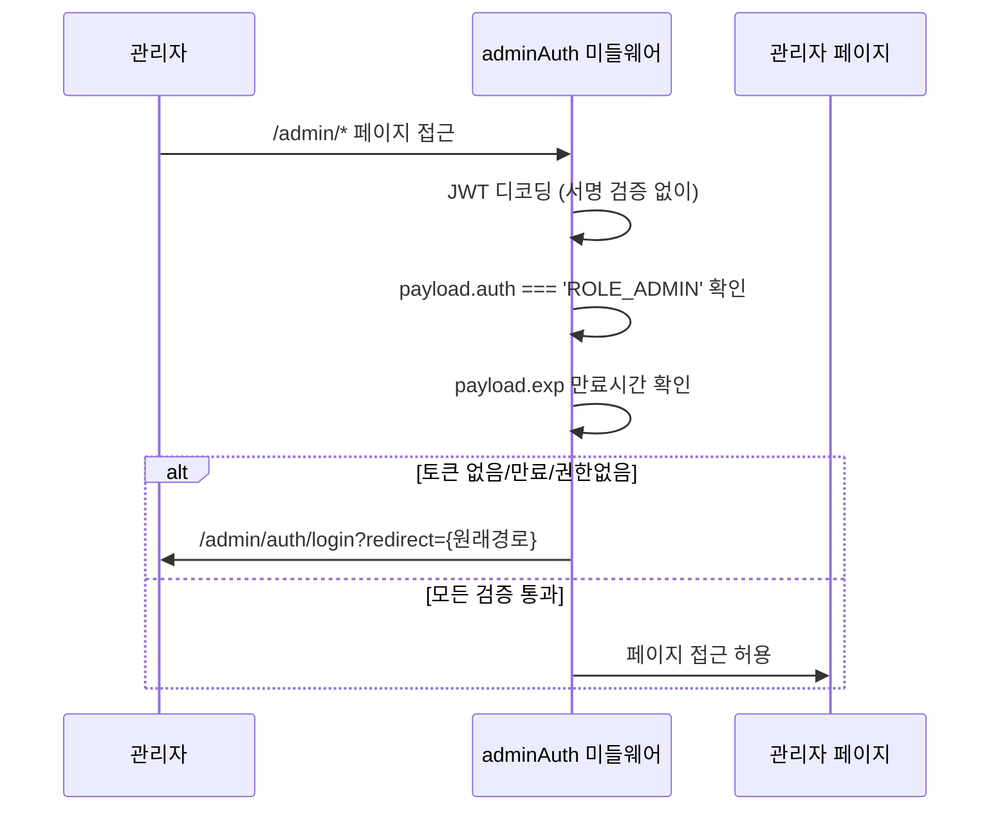
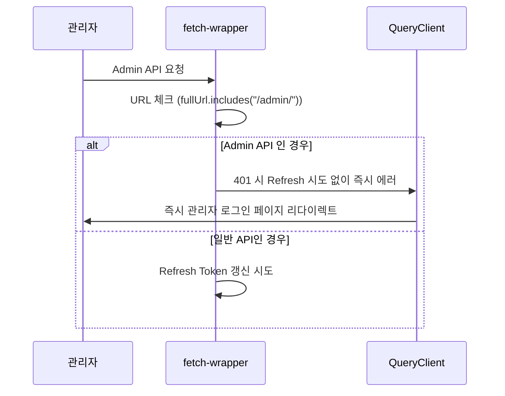

# 관리자 인증 프로세스

> 💡 **전체 API 아키텍처**는 [API_아키텍처.md](./API_아키텍처.md) 문서를 참조하세요.

## 개요

이 문서는 **관리자 계정 전용 인증 시스템**의 특화된 기능과 보안 정책을 설명합니다. 일반 사용자와 차별화된 보안 강화 방식을 중심으로 다룹니다.

## 🔐 관리자 전용 보안 정책

### 1. Refresh Token 미사용 (핵심 차이점)
- **일반 사용자**: Refresh Token으로 자동 갱신
- **관리자**: Access Token 만료 시 강제 재인증
- **목적**: 토큰 탈취 시 공격 기회 창 최소화

### 2. 즉시 로그아웃 정책
- **401 에러 시**: Refresh 시도 없이 즉시 로그인 페이지 리다이렉트
- **토큰 만료 시**: 자동 연장 없이 재인증 요구
- **보안 우선**: 사용자 편의성보다 보안 극대화

## 🚀 관리자 특화 인증 플로우

### 1. 미들웨어 레벨 보안 (페이지 접근 시)



### 2. API 호출 시 401 처리 (관리자 전용)



## 🔧 관리자 전용 구현 특징

### 핵심 차이점: 보안 우선 정책

관리자 인증은 일반 사용자와 다른 보안 우선 정책을 적용합니다:

1. **Refresh Token 미사용**: 토큰 만료 시 강제 재인증
2. **즉시 리다이렉트**: 401 응답 시 지연 없이 즉시 로그인 페이지 이동
3. **JWT 디코딩 방식**: 프론트엔드에서는 서명 검증 없이 기본 체크만 수행

## 핵심 파일 구조

### 관리자 전용 인증 파일
- `src/shared/lib/middleware/adminAuth.ts` - 관리자 미들웨어 (JWT 디코딩)
- `app/admin/auth/login/page.tsx` - 관리자 로그인 페이지
- `src/features/admin-auth/api/adminAuth.api.ts` - 관리자 로그인 API

## 주요 설정

### 관리자 페이지 미들웨어 매칭
```typescript
// proxy.ts - 관리자 페이지에만 인증 미들웨어 적용
export const config = {
  matcher: ["/admin/:path*"],
};
```

## 관리자 인증 문제 해결

### 토큰 관리자 권한 확인
- **JWT payload**: `auth` 값이 `ROLE_ADMIN`인지 확인
- **토큰 만료**: `exp` 값으로 만료시간 체크 (클라이언트 시간 기준)

### 리다이렉트 이슈
- **무한 루프**: 로그인 페이지(`/admin/auth/login`)는 미들웨어 체크에서 제외
- **원래 페이지 복원**: `redirect` 파라미터로 로그인 후 이동할 페이지 저장

## 보안 우선 설계

### 관리자 전용 보안 강화 방식
- **토큰 탈취 위험 최소화**: Refresh Token 미사용으로 공격 기회 창 단축
- **즉시 보안 대응**: 401 응답 시 지연 없는 즉시 로그아웃
- **계층화된 검증**: 미들웨어 기본 체크 + 백엔드 완전 검증

### 향후 강화 방향
- 세션 타임아웃 경고 알림
- 관리자 활동 로그 강화
- 역할별 세분화된 권한 제어