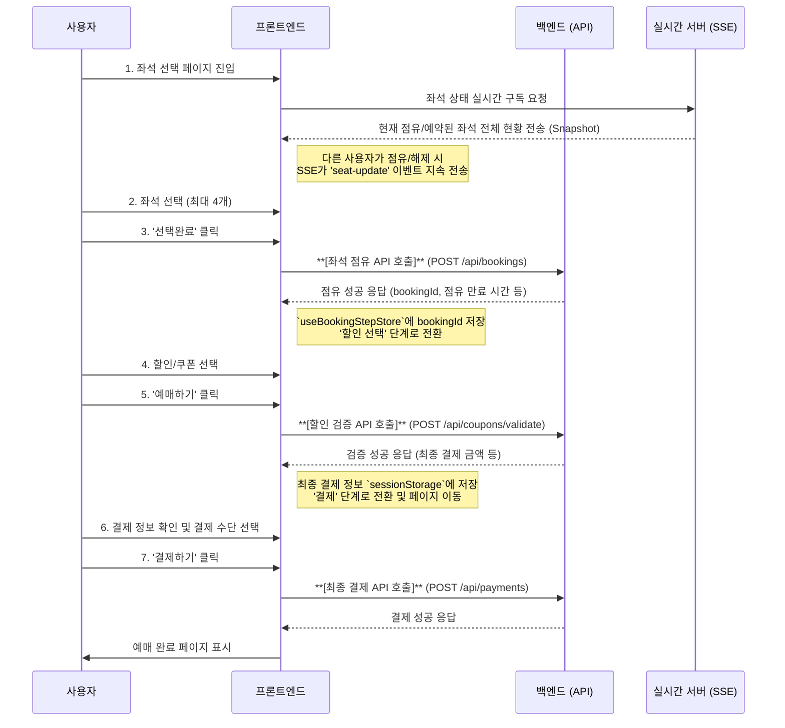

# 예매 프로세스 플로우 가이드 (통합본)

**최종 수정일**: 2026-01-10
**대상**: 개발자, 기획자, QA

## 1. 개요

본 문서는 사용자가 공연을 예매하는 전체 과정(좌석 선택부터 결제까지)의 기술적 흐름과 정책을 설명합니다. 코드를 기반으로 각 단계별 사용자 인터페이스, 데이터 흐름, API 통신, 상태 관리를 명확히 하여 기획, 개발, QA 간의 싱크를 맞추는 것을 목표로 합니다.

**주요 기술 요소:**
- **상태 관리**: `Zustand` (`useBookingStepStore`)를 사용하여 예매 단계를 관리하며, `sessionStorage`에 상태를 저장하여 페이지 새로고침에도 데이터가 유지됩니다.
- **실시간 좌석 현황**: `SSE (Server-Sent Events)`를 통해 다른 사용자가 선택(점유)하거나 예매 완료한 좌석 정보를 실시간으로 받아와 좌석 배치도에 반영합니다.
- **API 통신**: `React Query`를 통해 서버와 비동기 통신을 관리하며, 좌석 점유, 할인 검증, 예매 취소 등의 API를 호출합니다.

---

## 2. 전체 예매 프로세스 다이어그램



---

## 3. 단계별 상세 플로우

### Step 1: 좌석 선택 (`SEAT_SELECTION`)

**목표**: 사용자가 원하는 좌석을 실시간으로 확인하며 선택합니다.

**주요 로직 및 코드**:
- **UI**: `SeatSelectionStep.tsx`
- **상태/로직**: `useBookingSeatSelection.ts`, `useSeatSSESubscription.ts`

**화면 구성**:
```
┌────────────────────────────────────────┐
│  [공연 제목]           [일정변경]      │  ← BookingHeader
│                  결제 가능 시간: --:-- │
├────────────────────────────────────────┤
│                                        │
│  [좌석 배치도]          [선택 좌석 정보]│
│   ┌────┐                                │
│   │무대│              선택좌석 2        │
│   └────┘              VIP석 1열 5번     │
│   ○●○●○             50,000원         │
│   ○○●○○             R석 3열 2번      │
│                       30,000원         │
│  [등급별 가격 팝오버]                  │
│                       [전체삭제]        │
│                                        │
│                       총 80,000원      │
│                       [선택완료]        │
└────────────────────────────────────────┘
```

**프로세스 상세**:
1.  **페이지 진입 및 SSE 연결**:
    - 사용자가 좌석 선택 페이지에 진입하면, `useSeatSSESubscription` 훅이 즉시 해당 공연 회차의 SSE 엔드포인트(`api/schedule/{scheduleId}/sse`)에 연결을 시작합니다.
    - **(Snapshot)**: 연결 직후, SSE 서버는 현재 **"임시 점유(pending)"** 및 **"예약 완료(reserved)"** 상태인 모든 좌석의 목록을 `snapshot` 이벤트로 한 번에 보내줍니다. 프론트엔드는 이 정보를 받아 좌석 배치도(`SeatChart`)에 해당 좌석들을 비활성화 처리합니다.
    - **(실시간 업데이트)**: 이후 다른 사용자가 좌석을 선택하거나 선택을 취소하면, SSE 서버는 `seat-update` 이벤트를 통해 변경된 좌석 정보(점유/해제)를 실시간으로 전송하고, 프론트엔드는 이를 즉시 좌석 배치도에 반영합니다. (자세한 내용은 [5. 실시간 좌석 상태 동기화 (SSE)](#5-실시간-좌석-상태-동기화-sse) 참조)

2.  **좌석 선택**:
    - 사용자는 활성화된 좌석을 클릭하여 선택합니다.
    - `toggleSeatSelectionWithLimit` 함수가 호출되며, 최대 **4개**까지만 좌석을 선택할 수 있도록 제한합니다. 4개 초과 선택 시 토스트 메시지("최대 4개의 좌석만 선택할 수 있습니다.")를 표시합니다.
    - 선택된 좌석 정보와 총금액이 `SelectSeatInfo.tsx` 컴포넌트에 표시됩니다.

3.  **좌석 점유 요청 (선택 완료)**:
    - 사용자가 '선택완료' 버튼을 클릭하면 `handleCompleteSelection` 함수가 실행됩니다. (선택된 좌석이 없으면 버튼은 비활성화됩니다)
    - `useStartBooking` 훅을 통해 **좌석 점유 API (`POST /api/bookings`)** 를 호출합니다. 이 때 선택한 좌석의 위치 정보(`row`, `col`)를 서버에 전송합니다.
    - **[중요]** 서버는 해당 좌석을 **"임시 점유(pending)"** 상태로 변경하고, 이 예매 시도의 고유 식별자인 `bookingId`와 점유 만료 시간(예: 10분)을 응답으로 보내줍니다.
    - 프론트엔드는 성공 응답으로 받은 `bookingData`(bookingId, remainingSeconds 등 포함)를 `useBookingStepStore`에 저장하고, 예매 단계를 `DISCOUNT_SELECTION`으로 변경하며 타이머를 시작합니다.

---

### Step 2: 할인 선택 (`DISCOUNT_SELECTION`)

**목표**: 점유한 좌석에 대해 적용할 할인(쿠폰)을 선택하고 최종 금액을 확정합니다.

**주요 로직 및 코드**:
- **UI**: `DiscountSelectionStep.tsx`, `BookingDiscountSelectionForm.tsx`
- **상태/로직**: `useBookingStepControl.ts`, `BookingSeatingChart.tsx`
- **예외 처리**: `BookingUnloadManager.tsx`

**화면 구성**:
```
┌────────────────────────────────────────┐
│  [공연 제목]                            │  ← BookingHeader
│           결제 가능 시간: 09:45 (파란색)│
├────────────────────────────────────────┤
│                                        │
│  [좌석 배치도]          [할인 선택 폼]  │
│  (읽기 전용)                            │
│   ┌────┐              VIP석 (1매)      │
│   │무대│              1열 2번           │
│   └────┘              ○ 일반 50,000원  │
│   ○●○○○             ○ 조기예매 45,000원│
│   ○○●○○                                │
│                       R석 (1매)        │
│                       3열 2번           │
│                       ○ 일반 30,000원  │
│                       ○ 학생할인 24,000원│
│                                        │
│                       [이전]  [결제하기]│
└────────────────────────────────────────┘
```

**프로세스 상세**:
1.  **화면 구성**:
    - 좌석 배치도는 **읽기 전용**으로 표시되어 선택된 좌석을 확인만 할 수 있습니다.
    - `BookingDiscountSelectionForm`을 통해 선택한 각 좌석의 등급(`VIP석`, `R석` 등)에 따라 적용할 할인(일반, 청소년, 특정 쿠폰 등)을 선택합니다.
    - 폼 스키마(`createBookingDiscountSchema`)는 **"모든 좌석에 할인이 적용되었는지"** 그리고 **"할인 수량의 합이 좌석 수를 초과하지 않는지"**를 Zod를 통해 동적으로 검증합니다.

2.  **할인 검증 요청**:
    - 사용자가 '예매하기' 버튼을 클릭하면 `handleCompleteDiscount` 함수가 실행됩니다.
    - `useValidateCoupons` 훅을 통해 **할인 검증 API (`POST /api/coupons/validate`)** 를 호출합니다. 이 때 `bookingId`와 각 좌석(`bookingSeatId`)에 적용할 `couponId` 목록을 전송합니다.
    - 서버는 쿠폰의 유효성을 검증하고, 할인이 적용된 최종 결제 금액(`totalFinalPrice`)을 계산하여 응답합니다.

3.  **결제 단계로 전환**:
    - 서버로부터 `allValid: true` 응답을 받으면, 다음 단계를 위해 데이터를 가공하고 저장합니다.
        - `createPaymentConfirmationData`: 서버 응답을 바탕으로 결제 페이지에 필요한 최종 데이터(`PaymentConfirmationData`)를 생성합니다.
        - `setPaymentConfirmation`: 생성된 최종 결제 정보를 `useBookingStepStore`를 통해 `sessionStorage`에 저장합니다.
    - 예매 단계를 `PAYMENT`로 변경하고, 결제 페이지 (`/booking/payment`)로 라우팅합니다.

4.  **[예외 처리] 예매 프로세스 이탈**:
    - 이 단계에서 사용자가 페이지를 새로고침 하거나, 브라우저를 닫는 등 예매를 중단하려 할 경우 `BookingUnloadManager`가 동작합니다.
    - **(이탈 방지)** `beforeunload` 이벤트가 발생하여 사용자에게 "이 페이지를 벗어나시겠습니까?" 라는 브라우저 확인창을 띄웁니다.
    - **(좌석 점유 해제)** 사용자가 이탈을 확정하면 `unload` 이벤트가 발생하여 `navigator.sendBeacon` API를 통해 **예매 취소(좌석 점유 해제) API (`DELETE /api/bookings/{bookingId}`)** 를 안정적으로 호출합니다. 이를 통해 다른 사용자가 해당 좌석을 예매할 수 있도록 점유를 해제합니다.
    - '좌석선택으로 돌아가기' 버튼 클릭 시에도 동일하게 확인창 후 좌석 점유 해제 API가 호출됩니다.

---

### Step 3: 결제 (`PAYMENT`)

**목표**: 최종 확인된 정보를 바탕으로 실제 결제를 완료합니다.

**주요 로직 및 코드**:
- **UI**: `BookingPayment.tsx`
- **데이터 소스**: `useBookingStepStore` (sessionStorage)

**프로세스 상세**:
1.  **페이지 진입**:
    - 페이지가 렌더링되면 `sessionStorage`에 저장된 `paymentConfirmation` 데이터를 `useBookingStepStore`를 통해 불러옵니다. 이 데이터가 없으면 비정상적인 접근으로 간주하고 `404 Not Found` 페이지를 표시합니다.

2.  **최종 정보 표시**:
    - `TicketOrderDetail`: 예매하려는 공연, 날짜, 좌석 정보 표시.
    - `ReservationInfo`: 예매자 정보(이름, 이메일, 연락처) 표시.
    - `BookingPaymentInfo`: 할인 및 예매 수수료가 모두 반영된 최종 결제 금액 표시.
    - `PaymentMethodSelector`: '무통장 입금', '카카오페이' 등 결제 수단 선택.
    - `TermsAgreement`: 구매 관련 약관 동의.

3.  **결제 실행**:
    - 사용자가 '총 OOO원 결제하기' 버튼을 클릭합니다.
    - 선택된 결제 수단에 따라 PG사(결제 대행사) 모듈을 호출하고, 최종 **예매 확정 API (`POST /api/payments`)** 를 호출합니다.
    - 결제가 성공적으로 완료되면, 서버는 해당 예매의 상태를 "임시 점유(pending)"에서 **"예약 완료(reserved)"** 로 변경합니다.
    - 프론트엔드는 사용자에게 예매 완료 페이지를 보여주고, 예매 관련 상태(Store)를 초기화합니다.

---

## 4. 뒤로가기 및 복원 로직

### 4.1. Step 2 → Step 1 (좌석 점유 해제)

```
Step 2에서 [이전] 버튼 클릭
  ↓
확인 대화상자: "좌석선택으로 이동 시 선택하신 좌석의 점유는 해제됩니다."
  ↓
사용자 '확인' 선택
  ↓
좌석 점유 해제 API 호출 (DELETE /api/bookings/{bookingId})
  ↓
Store 초기화 (reset) 및 Step 1로 이동
```

### 4.2. Step 3 → Step 2 (선택 상태 복원)

```
Step 3에서 브라우저 뒤로가기 또는 '이전' 버튼 클릭
  ↓
prevStep() 호출 (step: 3 → 2, paymentConfirmation: null)
  ↓
Step 2 화면 재렌더링
  ↓
Store에 저장된 `savedSeatPositions` 값으로 이전에 선택했던 좌석들(`toggleSeatSelection`)을 다시 선택 처리
  ↓
사용자는 이전에 선택했던 좌석과 할인 정보를 다시 확인하고 수정 가능
  ↓
복원에 사용된 `savedSeatPositions`는 Store에서 삭제 (일회성)
```

---

## 5. 실시간 좌석 상태 동기화 (SSE)

### 5.1. SSE 연결 생명주기
- **연결**: Step 1 (좌석 선택) 페이지 진입 시 `EventSource`로 SSE 연결 시작.
- **유지**: Step 1, 2, 3을 전환하는 동안 연결 유지.
- **종료**: 예매 완료, 예매 프로세스 이탈(타이머 만료, `BookingUnloadManager` 동작 등) 시 `eventSource.close()` 호출로 연결 종료.

### 5.2. 이벤트 타입

#### `snapshot` (초기 상태)
- **시점**: SSE 최초 연결 시 한 번만 발생.
- **데이터**: 현재 점유(`pending`) 및 예약 완료(`reserved`)된 모든 좌석 정보.
- **처리**: 받은 모든 좌석을 '점유' 상태로 간주하고 UI에 비활성화 처리.

```json
// snapshot 이벤트 데이터 예시
{
  "pending": [{ "row": 1, "col": 3, "section": "A" }],
  "reserved": [{ "row": 0, "col": 1, "section": "A" }]
}
```

#### `seat-update` (실시간 업데이트)
- **시점**: 다른 사용자가 좌석을 점유하거나 해제할 때마다 발생.
- **데이터**: 변경된 액션(`OCCUPIED` 또는 `RELEASED`)과 해당 좌석 정보.
- **처리**:
    - `OCCUPIED`: 해당 좌석을 UI에서 비활성화.
    - `RELEASED`: 해당 좌석을 UI에서 다시 활성화.

```json
// seat-update 이벤트 데이터 예시
{
  "action": "OCCUPIED",
  "seats": [{ "row": 1, "col": 3, "section": "A" }]
}
```

---

## 6. 타이머 시스템

- **시작**: Step 1에서 좌석 점유 API 호출 성공 시, 응답으로 받은 `remainingSeconds` (또는 `expiresAt`) 기준으로 카운트다운 시작.
- **표시**: 헤더에 남은 시간(MM:SS 형식) 표시. 1분 미만일 경우 주황색으로 강조.
- **만료 처리**:
  - **일반적인 경우**: 타이머가 0이 되면 "결제 가능 시간이 만료되었습니다" 알림창을 띄우고, Store를 초기화한 후 공연 상세 페이지로 리디렉션.
  - **PG 결제 진행 중 (예외)**: 사용자가 PG 결제 팝업을 열어 결제를 진행 중인 경우(`isPaymentProcessing: true`), 타이머가 만료되어도 **리디렉션하지 않고 대기**합니다.
    - **결제 성공 시**: 서버로 예매 확정을 요청합니다. 만약 서버에서 시간 만료로 거절할 경우, 사용자에게 알리고 결제 취소 프로세스를 수행합니다.
    - **결제 취소/실패 시**: PG 팝업이 닫히고 `isPaymentProcessing`이 해제되는 순간, 만료 로직이 동작하여 리디렉션됩니다.
- **지속성**: Step 2와 Step 3을 오가는 동안 타이머는 계속 유지됨. Step 2에서 Step 1로 돌아갈 때(점유 해제 시) 타이머는 중지됨.

---

## 7. 상태 관리 (Zustand Store)

`sessionStorage`와 연동하여 사용자가 예매 도중 페이지를 새로고침해도 상태가 유지되도록 합니다.

**주요 상태**:
- `step`: 현재 예매 단계 (`1`, `2`, `3`).
- `bookingData`: 좌석 점유 API 성공 시 받는 데이터 (`bookingId`, `remainingSeconds` 등).
- `selectedDiscountInput`: Step 2에서 사용자가 선택한 할인/쿠폰 정보.
- `paymentConfirmation`: Step 3 결제 페이지에 필요한 모든 정보의 최종 집합.
- `savedSeatPositions`: Step 3에서 2로 복귀 시 선택 좌석을 복원하기 위한 좌표 정보.

---

## 8. 에러 처리 시나리오

- **좌석 점유 실패**: 다른 사용자가 동시 선택 등. Step 1에 머무르며 사용자에게 재시도 유도.
- **할인 검증 실패**: 서버 응답이 `allValid: false`일 경우. 토스트 메시지로 알리고 Step 2에 머무르며 재선택 유도.
- **SSE 연결 끊김**: 토스트 메시지로 "실시간 좌석 상태 업데이트 연결이 종료되었습니다." 알림. 실시간 업데이트는 중단되지만 예매 기능 자체는 계속 사용 가능.

---

## 9. 부록: 주요 API 엔드포인트

| API | Method | 설명 | 타이밍 |
|-----|--------|------|--------|
| `/api/bookings` | POST | 좌석 점유 | Step 1 → 2 |
| `/api/bookings/{id}` | DELETE | 좌석 점유 해제 | Step 2 → 1 또는 이탈 시 |
| `/api/coupons/validate` | POST | 쿠폰 검증 | Step 2 → 3 |
| `/api/payments` | POST | 최종 결제 확정 | Step 3 완료 시 |
| `/api/schedules/{id}/sse` | GET | 실시간 좌석 상태 구독 (SSE) | Step 1 진입 시 |
