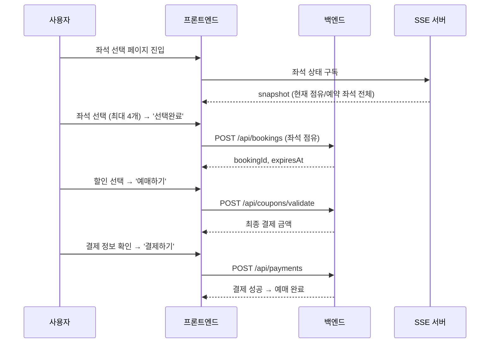

# PRD: 공연 예매 프로세스

**최종 수정일**: 2026-01-12
**상태**: 🟡 구현 완료 (미해결 이슈 4건)
**담당 레이어**: `views/service/booking-*`, `features/booking/*`, `entities/booking`

---

## 개요

좌석 선택 → 할인 선택 → 결제 3단계로 이루어지는 공연 예매 프로세스.

**주요 기술 요소:**
- **상태 관리**: `Zustand` (`useBookingStepStore`) + `sessionStorage` 지속성
- **실시간 좌석**: `SSE (Server-Sent Events)` → `snapshot` + `seat-update` 이벤트
- **API 통신**: `React Query`

---

## 전체 플로우 다이어그램



---

## 단계별 상세

### Step 1: 좌석 선택 (`SEAT_SELECTION`)

- **UI**: `SeatSelectionStep.tsx`
- **핵심 로직**: `useBookingSeatSelection.ts`, `useSeatSSESubscription.ts`
- 페이지 진입 시 SSE 연결 → snapshot 수신 → 실시간 `seat-update` 반영
- 최대 4개 좌석 선택, '선택완료' → 좌석 점유 API 호출
- 점유 성공 시 `bookingData` 저장, Step 2로 전환 + 타이머 시작

### Step 2: 할인 선택 (`DISCOUNT_SELECTION`)

- **UI**: `DiscountSelectionStep.tsx`, `BookingDiscountSelectionForm.tsx`
- 좌석 배치도 읽기 전용, 좌석 등급별 할인 선택
- Zod `createBookingDiscountSchema`로 수량 검증 (모든 좌석에 할인 1:1 매핑)
- '예매하기' → 쿠폰 검증 API → `paymentConfirmation` sessionStorage 저장 → Step 3
- **이탈 처리**: `BookingUnloadManager` - `beforeunload` 경고 + `sendBeacon`으로 점유 해제

### Step 3: 결제 (`PAYMENT`)

- **UI**: `BookingPayment.tsx`
- sessionStorage의 `paymentConfirmation` 없으면 404
- 컴포넌트: `TicketOrderDetail`, `ReservationInfo`, `BookingPaymentInfo`, `PaymentMethodSelector`, `TermsAgreement`
- '결제하기' → PG사 모듈 → `POST /api/payments` → 예매 완료 페이지

---

## 뒤로가기 로직

| 방향 | 동작 |
|------|------|
| Step 2 → Step 1 | 확인 다이얼로그 → 좌석 점유 해제 API → Store 초기화 |
| Step 3 → Step 2 | `savedSeatPositions`로 선택 좌석 복원 (일회성) |

---

## SSE 이벤트

| 이벤트 | 시점 | 처리 |
|--------|------|------|
| `snapshot` | 최초 연결 시 1회 | pending/reserved 좌석 전체 비활성화 |
| `seat-update` | 다른 사용자 좌석 변경 시 | `OCCUPIED` → 비활성화, `RELEASED` → 활성화 |

**SSE 생명주기**: Step 1 진입 시 연결 → Step 1~3 유지 → 예매 완료/이탈 시 종료

---

## 타이머 시스템

- 서버 응답의 `expiresAt`(ISO 8601) 기준으로 클라이언트에서 계산 (새로고침 안전)
- 1분 미만 시 주황색 강조
- 만료 시 → 공연 상세 페이지로 리다이렉트 (단, `isPaymentProcessing: true`면 대기)

---

## API 엔드포인트

| API | Method | 설명 | 단계 |
|-----|--------|------|------|
| `/api/schedules/{id}/sse` | GET | 실시간 좌석 구독 | Step 1 진입 |
| `/api/bookings` | POST | 좌석 점유 | Step 1 → 2 |
| `/api/bookings/{id}` | DELETE | 좌석 점유 해제 | Step 2 → 1, 이탈 |
| `/api/coupons/validate` | POST | 쿠폰 검증 | Step 2 → 3 |
| `/api/payments` | POST | 최종 결제 확정 | Step 3 완료 |

---

## 상태 관리 (Zustand Store)

| 상태 | 설명 |
|------|------|
| `step` | 현재 단계 (1/2/3) |
| `bookingData` | 점유 API 응답 (bookingId, expiresAt) |
| `selectedDiscountInput` | Step 2 할인 선택값 |
| `paymentConfirmation` | Step 3 결제 정보 |
| `savedSeatPositions` | Step 3→2 복귀 시 좌석 복원용 (일회성) |
| `isPaymentProcessing` | PG 결제 팝업 진행 중 여부 |

---

## 컴포넌트 & FSD 구조

```
views/service/
├── booking-seating-chart/     # Step 1: 좌석 선택
├── booking-discount-selection/ # Step 2: 할인 선택
└── booking-payment/           # Step 3: 결제

features/booking/
├── booking-seating-chart/
├── discount-grade-accordion/
├── booking-timer/
└── booking-payment/

entities/booking/              # API, 타입, 스키마
entities/discount/             # 할인 도메인
```

---

## 테스트 시나리오

### 정상 플로우
1. VIP 2개 선택 → 할인 1+1 → 결제 → 예매 완료
2. VIP 1 + R 2 (다중 등급) → 할인 각각 선택 → 결제

### 예외 케이스
- 할인방법 수량 불일치 → '예매하기' 비활성화
- 결제 타이머 만료 → 좌석 선택으로 리다이렉트, 상태 초기화
- 좌석 선점 실패 (동시 예매) → 에러 메시지 + 재선택 유도
- 예약자 정보 입력 오류 → 필드별 에러 메시지
- 최대 좌석 4개 초과 선택 → 토스트 메시지
- 새로고침 → sessionStorage에서 상태 복원, 타이머 `expiresAt` 기준 유지

---

## 미해결 이슈

| # | 이슈 | 상태 |
|---|------|------|
| 1 | 점유 시간 변경 요청했으나 남은시간 데이터 미반영 (서버 시간 동기화 확인 필요) | ❌ 미해결 |
| 2 | SSE 연결 종료 케이스 정의 미완료 (네트워크 오류 시 재연결 로직 부재) | ❌ 미해결 |
| 3 | 모바일 반응형 UI 미최적화 | ❌ 미해결 |
| 4 | PG 결제 팝업 중 타이머 만료 → Payment Lock 전략 미구현 (`isPaymentProcessing` 플래그로 리다이렉트 막기, 만료 후 결제 성공 시 환불 처리 필요) | ❌ 미해결 |

---

## 구현 체크리스트

### 완료
- [x] Step 1: 좌석 선택 + SSE 실시간 동기화
- [x] Step 2: 할인 선택 + Zod 검증
- [x] Step 3: 결제 화면
- [x] Zustand Store + sessionStorage 지속성
- [x] 타이머 (`expiresAt` 기준, 새로고침 안전)
- [x] 이탈 처리 (`BookingUnloadManager`, `BookingResetWatcher`)
- [x] Step 3 → Step 2 선택 좌석 복원
- [x] 타이머 만료 시 공연 상세로 리다이렉트

### 미완료
- [ ] 이슈 #1: 서버 점유 시간 동기화
- [ ] 이슈 #2: SSE 재연결 로직
- [ ] 이슈 #3: 모바일 반응형 대응
- [ ] 이슈 #4: Payment Lock 전략 구현
