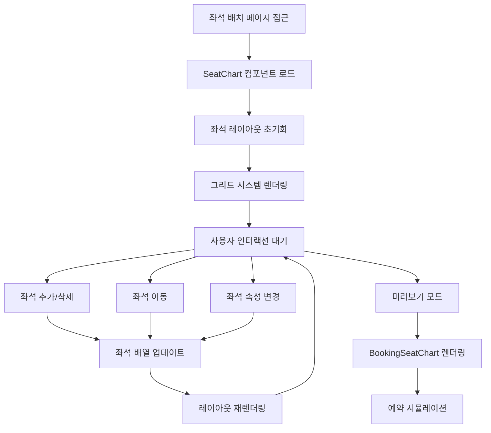

# 좌석 배치도 (SeatChart) 시스템 문서

## 개요

좌석 배치도 시스템은 사용자가 직관적으로 좌석을 배치하고 관리할 수 있는 기능을 제공합니다.

## 플로우 다이어그램



## 핵심 컴포넌트

### 1. SeatChart (편집 모드)
- **위치**: `app/seat/_components/SeatChart.tsx`
- **기능**: 좌석 배치 편집, 드래그 앤 드롭, 좌석 속성 설정
- **상태 관리**: 로컬 상태로 좌석 레이아웃 관리

### 2. BookingSeatChart (예약 모드)
- **위치**: `app/seat/_components/BookingSeatChart.tsx`
- **기능**: 실제 예약 시 사용되는 좌석 선택 인터페이스
- **특징**: 읽기 전용, 선택 가능한 좌석만 인터랙션

### 3. SeatConfig (설정 패널)
- **위치**: `app/seat/_components/SeatConfig.tsx`
- **기능**: 좌석 속성 설정 (타입, 가격, 상태 등)

## API 인터페이스

### 실제 타입 정의 (seatLayout.types.ts 기반)

```typescript
/**
 * 좌석 위치 정보
 */
interface SeatPosition {
  /** 행 번호 (0부터 시작) */
  row: number;
  /** 열 번호 (0부터 시작) */
  col: number;
}

/**
 * 좌석 타입 정의 (정적 데이터)
 */
interface SeatType {
  /** 좌석 타입 라벨 */
  label: string;
  /** CSS 클래스명 */
  cssClass: string;
  /** 가격 */
  price: number;
}

/**
 * 좌석 등급 설정 인터페이스 (정적 데이터)
 */
interface SeatGradeConfig {
  /** 좌석 타입 키 */
  seatTypeKey: string;
  /** 좌석 위치 문자열 ("3:" = 3행 전체, ":5" = 5열 전체, "3:5" = 3행 5열) */
  position: string;
}

/**
 * 정적 좌석 배치도 설정 (JSON 파일로 저장)
 */
interface StaticSeatVenue {
  /** 총 행 수 */
  rows: number;
  /** 총 열 수 */
  columns: number;
  /** 좌석 타입들 */
  seatTypes: Record<string, SeatType>;
  /** 좌석 등급 설정들 */
  seatGrades: SeatGradeConfig[];
  /** 비활성화된 좌석들 (물리적으로 존재하지 않는 좌석) */
  disabledSeats: SeatPosition[];
  /** 행 간격 추가 위치들 */
  rowSpacers: number[];
  /** 열 간격 추가 위치들 */
  columnSpacers: number[];
}

/**
 * 동적 예매 상태 데이터 (서버에서 실시간으로 받아오는 데이터)
 */
interface BookingStatus {
  /** 예약된 좌석들 (이미 결제 완료) */
  reservedSeats: SeatPosition[];
  /** 구매 진행 중인 좌석들 (임시 점유) */
  pendingSeats: SeatPosition[];
}

/**
 * 사용자 선택 좌석 상태 (클라이언트 상태)
 */
interface UserSeatSelection {
  /** 사용자가 선택한 좌석들 */
  selectedSeats: SeatPosition[];
}

/**
 * 좌석 차트 전체 설정 (정적 배치도 + 실시간 예매 상태 + 사용자 선택)
 */
interface SeatChartConfig extends StaticSeatVenue, BookingStatus, UserSeatSelection {
  /** 차트 모드 */
  mode: SeatChartMode;
}

/**
 * 좌석 차트 모드
 */
type SeatChartMode = "edit" | "view";

/**
 * 좌석 상태 타입
 */
type SeatStatus = "available" | "selected" | "reserved" | "pending" | "disabled";
```

## 백엔드 통신 요구사항

### 1. 정적 좌석 레이아웃 데이터 Fetch

```typescript
/**
 * 정적 좌석 배치도 데이터 로드
 * useSeatChart Hook에서 사용
 */
const loadStaticVenue = async (venueId: string): Promise<StaticSeatVenue> => {
  const response = await fetch(`/api/seat-venues/${venueId}`);
  if (!response.ok) throw new Error("Failed to load seat venue");
  return response.json();
};
```

### 2. 실시간 예매 상태 SSE 연결

```typescript
/**
 * Server-Sent Events를 통한 실시간 예매 상태 업데이트
 * useSeatChart Hook에서 사용
 */
const subscribeBookingStatus = (venueId: string) => {
  const eventSource = new EventSource(
    `/api/seat-venues/${venueId}/booking-status`
  );

  eventSource.onmessage = (event) => {
    const status: BookingStatus = JSON.parse(event.data);
    updateBookingStatus(status);
  };

  eventSource.onerror = () => {
    console.error("BookingStatus SSE connection error");
  };

  return () => eventSource.close();
};
```

### 3. 예상되는 응답 데이터 형식

```typescript
// 정적 좌석 데이터 응답
interface StaticSeatVenue {
  rows: number;
  columns: number;
  seatTypes: Record<string, SeatType>;
  seatGrades: SeatGradeConfig[];
  disabledSeats: SeatPosition[];
  rowSpacers: number[];
  columnSpacers: number[];
}

// SSE 실시간 예매 상태 데이터
interface BookingStatus {
  reservedSeats: SeatPosition[];  // 이미 결제 완료된 좌석
  pendingSeats: SeatPosition[];   // 구매 진행 중인 좌석
}
```

## 아이폰/iOS 이벤트 처리

### 실제 구현된 터치 이벤트 처리 (SeatChart.tsx 기반)

```typescript
/**
 * 터치 이벤트 중복 방지 로직
 */
let touchHandled = false;

const handleTouchStart = () => {
  touchHandled = false;
};

const handleTouchEnd = (e: React.TouchEvent) => {
  e.preventDefault();
  e.stopPropagation();
  if (touchHandled) return;
  touchHandled = true;
  
  if (!onSeatClick) return;
  if (isDisabled || isReserved || isPending) return;
  onSeatClick(rowIndex, colIndex);
};

const handleClick = (e: React.MouseEvent) => {
  // 터치 이벤트가 처리되었다면 마우스 이벤트 무시
  if (touchHandled) {
    touchHandled = false;
    return;
  }
  
  e.preventDefault();
  e.stopPropagation();
  if (!onSeatClick) return;
  if (isDisabled || isReserved || isPending) return;
  onSeatClick(rowIndex, colIndex);
};
```

### iOS 최적화 CSS 적용

```css
/* 실제 구현된 좌석 버튼 스타일 */
.seat-button {
  /* iOS 터치 최적화 */
  touch-action: manipulation;
  -webkit-tap-highlight-color: transparent;
  -webkit-user-select: none;
  user-select: none;
  
  /* 터치 반응 애니메이션 */
  transition: transform 0.1s ease;
}

.seat-button:active {
  transform: scale(0.95);
}

.seat-button.disabled {
  cursor: not-allowed;
  opacity: 0.6;
}

/* 모바일 호버 효과 제거 */
@media (hover: hover) and (pointer: fine) {
  .seat-button:hover {
    transform: scale(1.05);
  }
}
```

### 모바일 줌 컨트롤

```typescript
/**
 * 모바일 전용 줌 컨트롤 (실제 구현)
 */
const [zoomLevel, setZoomLevel] = useState(1);

const handleZoom = (delta: number) => {
  setZoomLevel(prev => {
    const newZoom = prev + delta;
    return Math.max(0.5, Math.min(2, newZoom)); // 0.5x ~ 2x 제한
  });
};

// JSX 렌더링
<div className="fixed bottom-4 right-4 flex flex-col gap-2 md:hidden">
  <button
    onClick={(e) => {
      e.preventDefault();
      e.stopPropagation();
      handleZoom(0.1);
    }}
    className="w-12 h-12 bg-blue-500 text-white rounded-full shadow-lg touch-manipulation"
  >
    +
  </button>
  <button
    onClick={(e) => {
      e.preventDefault();
      e.stopPropagation();
      handleZoom(-0.1);
    }}
    className="w-12 h-12 bg-blue-500 text-white rounded-full shadow-lg touch-manipulation"
  >
    −
  </button>
</div>
```

## 모바일 브라우저 새로고침 이슈

### 증상
- 개발 환경에서 모바일 브라우저 새로고침 시 페이지 로딩 실패
- Hot reload 기능이 모바일에서 불안정

### 해결 방안
1. **빌드 환경에서는 정상 동작**: `pnpm build && pnpm start`로 실행하면 문제없음
2. **개발 시 임시 해결책**:
   - 데스크톱에서 개발 후 모바일 테스트
   - 모바일에서는 빌드된 버전으로 테스트
3. **Next.js 설정 최적화**:
   ```javascript
   // next.config.js
   module.exports = {
     experimental: {
       optimizeCss: true,
     },
     compiler: {
       removeConsole: process.env.NODE_ENV === 'production',
     }
   };
   ```

### 권장사항
- 개발 중: 데스크톱 브라우저의 모바일 시뮬레이터 사용
- 최종 테스트: 빌드된 환경에서 실제 모바일 디바이스로 테스트
- CI/CD: 빌드 과정에서 모바일 호환성 자동 테스트 포함

## 성능 최적화

### 렌더링 최적화
```typescript
/**
 * 좌석 컴포넌트 메모이제이션
 */
const SeatComponent = React.memo(({ seat, onClick }: SeatProps) => {
  return (
    <div 
      className={`seat seat-${seat.type} seat-${seat.status}`}
      onClick={() => onClick(seat)}
    >
      {seat.seatNumber}
    </div>
  );
});

/**
 * 가상화를 통한 대용량 좌석 처리
 */
const VirtualizedSeatChart = ({ seats }: { seats: Seat[] }) => {
  // react-window 또는 react-virtualized 사용
  // 화면에 보이는 좌석만 렌더링
};
```

### 상태 관리 최적화
```typescript
/**
 * 좌석 상태 업데이트 배치 처리
 */
const useSeatUpdates = () => {
  const [pendingUpdates, setPendingUpdates] = useState<SeatUpdate[]>([]);
  
  /**
   * 배치 업데이트 처리 (100ms 지연)
   */
  const debouncedUpdate = useMemo(
    () => debounce((updates: SeatUpdate[]) => {
      // API 호출로 일괄 업데이트
      updateSeatsInBatch(updates);
    }, 100),
    []
  );
  
  return { addUpdate: (update: SeatUpdate) => {
    setPendingUpdates(prev => [...prev, update]);
    debouncedUpdate(pendingUpdates);
  }};
};
```